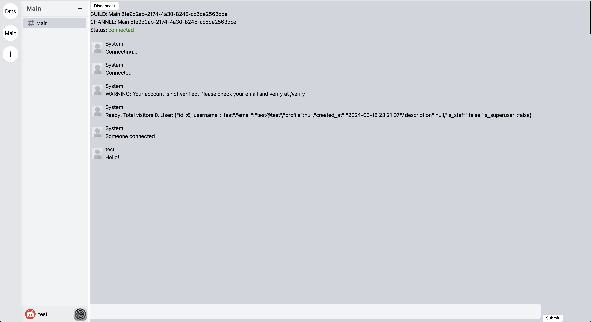

<p align="center"> 
  
</p>
<h1 align="center"> Flettext </h1>

## Overview

Flettext is an extensive real-time instant messaging application designed to connect people from all over the world. Provided features include guilds (container of channels), channels (container of messages), etc. You may create a guild to talk with a group of friends, or just directly message your friend. There is also a global chat where you can make new friends!


## Why this project was made

Flettext was made to test the usage and capabilities of WebSockets, as well as essentials of every modern software application - authentication, data storage, sessions, etc. Frontend and user interface was not the primary focus of this project, therefore aesthetics are relatively lacking on every page except the main application.

## Technologies

Frontend:
- SvelteKit
- TailwindCSS

Backend
- tokio + actix-web + actix-cors + actix-ws + actix-http + actix-identity + actix-session
- sqlx
- postgres

## Usage and demo

<p align="center"> 
  
  Picture of flettext main application window
</p>

Demo: [https://pineapple-deploy.vercel.app/](https://pineapple-deploy.vercel.app/)

*Note: captcha is sometimes broken due to cross-origin cookies (I cannot afford to get a real domain to solve this issue). Signup and login may not function as intended, and error messages can be observed in the network tab in inspect/devtools*

## Setup Instructions

> Run `git clone https://github.com/Flettex/flettext` to clone the repository and `cd` into the flettext folder

### Submodules

> Run `git submodule update --recursive --init` to clone the frontend and backend repositories

### Backend

The backend is programmed in Rust, therefore you will need the rust toolchains which includes cargo.

#### **Backend prerequisites**

> cargo >= 1.67.1, rustc >= 1.67.1

Tools prerequisites:
> cargo-watch >= 8.1.1, sqlx-cli >= 0.7.1

### Instructions

1. `cd` into the backend folder

    ```shell
    cd src/raspberry
    ```

2. Create an `.env` in the backend folder file containing

    ```txt
    DATABASE_URL='postgres://<user>:<password>@localhost:5433/<database>'
    DATABASE_PROD_URL='...' # this is optional
    RUST_LOG=INFO,sqlx=TRACE
    # SQLX_OFFLINE=true
    EMAIL_PASSWORD='<your_gmail_2fa_password>' # make sure to modify the email
    SECRET_KEY='<32_randomly_generated_2_digit_positive_integers_separated_by_commas>'
    ```

    replace the `<>` with the relevant values

    Note: You can use cockroachdb.

3. Install the dependencies after exporting the env file variables

    ```shell
    export $(grep -v '^#' .env.prod | xargs) # note that this is zsh syntax in macOS, adjust accordingly
    cargo build
    ```

4. Apply the database migrations

    ```shell
    export $(grep -v '^#' .env.prod | xargs) # you need this for DATABASE_URL env variable
    sqlx database create
    sqlx migrate run
    ```

5. Run the server

    ```shell
    export $(grep -v '^#' .env.prod | xargs) # if you are in a new terminal syntax
    cargo run
    # OR
    cargo watch -x run --ignore src/html.rs # html.rs is generated at build time, this flag is to prevent infinite loops
    ```

### Frontend

#### **Frontend prerequisites**

> Node version > 18.15.0 and npm version > 9.5.0

1. `cd` into the frontend folder

    ```shell
    cd src/pineapple-svelte # the pineapple folder is the legacy next.js version, it is no longer maintained
    ```

2. Install the dependencies

    ```shell
    npm install
    # OR
    pnpm install
    # OR
    bun install
    ```

3. Run the frontend

    ```shell
    npm run dev
    # OR
    pnpm dev
    # OR
    bun dev
    ```
